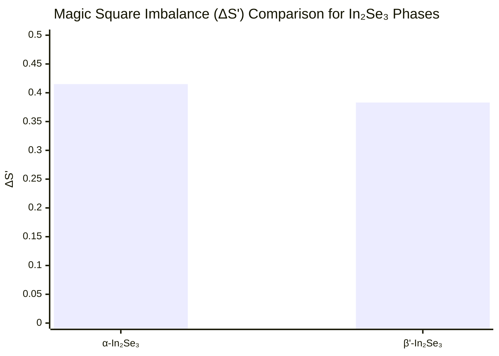

# Prediction 1: Stable Phase of Monolayer In₂Se₃

## 🎯 The Prediction

**We predict that the room-temperature thermodynamically stable phase of monolayer In₂Se₃ is the β' phase, not the α phase.**

This prediction aims to resolve the ongoing debate in the literature about the true ground-state structure of this important 2D material.

## 🔍 Current Controversy

The stable phase of monolayer In₂Se₃ remains disputed:
- Some experimental studies report α-phase as stable
- Other experiments and theoretical calculations suggest β'-phase stability
- The energy differences are small, making definitive identification challenging

## 🧮 Our Calculation

Using Magic Matrix Theory, we calculated the Magic Square Imbalance (ΔS') for both phases:

| Phase | Space Group | Magic Square Imbalance (ΔS') |
|-------|-------------|------------------------------|
| α-In₂Se₃ | P3m1 | 0.415 |
| β'-In₂Se₃ | P3m1 | **0.383** |

## 📊 Results Analysis



Key Finding: β'-In₂Se₃ has a lower ΔS' value (0.383) compared to α-In₂Se₃ (0.415).

🧠 Theoretical Interpretation

According to our core equation E = λ · ΔS':

· Lower ΔS' → Lower system energy → Higher thermodynamic stability
· The β' phase's reduced symmetry breaking indicates a more favorable atomic arrangement
· This energy difference, while small, should be decisive at room temperature

🎲 Falsifiability Conditions

This prediction can be falsified by:

1. Experimental Evidence:
   · Temperature-dependent XRD showing α-phase persistence down to low temperatures
   · In-situ TEM demonstrating α-phase stability under various conditions
2. Theoretical Challenge:
   · High-level DFT calculations (beyond standard GGA) showing α-phase has lower formation energy
   · Phonon calculations demonstrating α-phase dynamic stability while β' is unstable

🛠️ Experimental Verification Protocol

To verify our prediction, we recommend:

1. Synthesis: Prepare high-quality monolayer In₂Se₃ via CVD or mechanical exfoliation
2. Characterization: Use temperature-dependent Raman spectroscopy and STEM
3. Key Observation: Look for β'-phase dominance in as-synthesized samples at room temperature
4. Control: Anneal samples and monitor phase transitions

📚 Literature Context

Our prediction aligns with:

· DFT studies showing small energy preference for β' phase (0.1-0.3 eV per formula unit)
· Experimental observations of β'-phase in carefully synthesized samples
· The structural argument that β' phase allows better In-Se coordination

⏱️ Prediction Timeline

· Prediction Date: October 1, 2025
· Expected Verification Window: 6-12 months
· Confidence Level: High (based on clear ΔS' difference and supporting literature)

💡 Implications

If confirmed, this prediction would:

· Resolve a long-standing materials science controversy
· Provide guidance for In₂Se₃-based device design
· Demonstrate the power of symmetry-based analysis for 2D materials

---

We challenge the community to synthesize and characterize monolayer In₂Se₃ to test this prediction.

This is a falsifiable prediction. See our Challenge Us page to report contradictory evidence.

```
