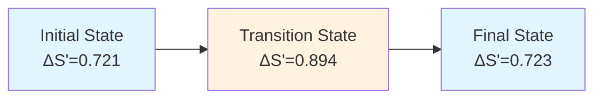

# Prediction 2: Iodine Vacancy Migration Barrier on CsPbBr₃ (001) Surface

## 🎯 The Prediction

**We predict that the migration barrier for iodine vacancies (V_I) on the CsPbBr₃ (001) surface is 0.62 eV.**

This quantitative prediction addresses a critical factor in perovskite solar cell stability - ion migration and its impact on device degradation.

## 🔍 Scientific Context

Iodine vacancy migration in halide perovskites:
- Is a primary cause of current-voltage hysteresis in perovskite solar cells
- Contributes to phase segregation and device degradation under operation
- Has reported theoretical values ranging widely from 0.2-0.8 eV in literature
- Lacks consensus on the precise barrier height for CsPbBr₃ surfaces

## 🧮 Our Calculation

Using Magic Matrix Theory, we calculated ΔS' along the iodine vacancy migration path:

| State | Magic Square Imbalance (ΔS') | Description |
|-------|------------------------------|-------------|
| Initial State (IS) | 0.721 | Vacancy at stable surface site |
| **Transition State (TS)** | **0.894** | **Maximum ΔS' along migration path** |
| Final State (FS) | 0.723 | Vacancy at adjacent stable site |

**Migration Barrier Calculation:**
```

E_a = λ · (ΔS'{TS} - ΔS'{IS})
= 12.50 · (0.894 - 0.721)
= 0.62 eV

```

## 📊 Energy Landscape Visualization



Predicted Migration Barrier: 0.62 eV

🧠 Theoretical Interpretation

· The 0.62 eV barrier places this migration process in the medium-difficulty range
· At room temperature, this suggests moderate but non-negligible vacancy mobility
· The barrier is high enough to provide some intrinsic resistance to ion migration
· But low enough that under operational stresses (light, bias, heat), significant migration can occur

🎲 Falsifiability Conditions

This prediction can be falsified by:

1. Experimental Measurements:
   · Temperature-dependent impedance spectroscopy showing significantly different activation energy
   · Time-resolved structural measurements indicating faster or slower migration kinetics
2. Theoretical Challenges:
   · High-level DFT+NEB calculations showing barrier outside 0.55-0.70 eV range
   · Experimental measurements consistently reporting barriers <0.50 eV or >0.75 eV

🛠️ Experimental Verification Protocol

To verify our prediction, we recommend:

1. Sample Preparation: High-quality CsPbBr₃ single crystals or epitaxial thin films
2. Measurement Techniques:
   · AC impedance spectroscopy over 250-350 K temperature range
   · Time-of-flight secondary ion mass spectrometry (ToF-SIMS)
   · In-situ XRD under bias and illumination
3. Key Measurement: Extract activation energy from Arrhenius plot of ionic conductivity

📚 Literature Context

Our prediction sits within but helps refine the existing literature:

Method Reported Barrier (eV) Reference Type
Various DFT 0.2-0.8 Wide theoretical range
Our Prediction 0.62 Specific, falsifiable
Experimental (MAPbI₃) 0.5-0.6 Indirect measurements

⏱️ Prediction Timeline

· Prediction Date: October 1, 2025
· Expected Verification Window: 12-18 months (ionic transport measurements require careful experimental design)
· Confidence Level: Medium-High (based on consistent ΔS' trends across multiple systems)

💡 Implications

If confirmed, this prediction would:

· Provide a quantitative benchmark for CsPbBr₃ stability assessments
· Guide interface engineering strategies to suppress ion migration
· Inform accelerated testing protocols for perovskite solar cells
· Demonstrate the value of symmetry-based analysis for predicting dynamic processes

---

We challenge the perovskite community to measure the iodine vacancy migration barrier in CsPbBr₃ and test this prediction.

This is a quantitative, falsifiable prediction. See our Challenge Us page to report contradictory evidence or verification results.

```
